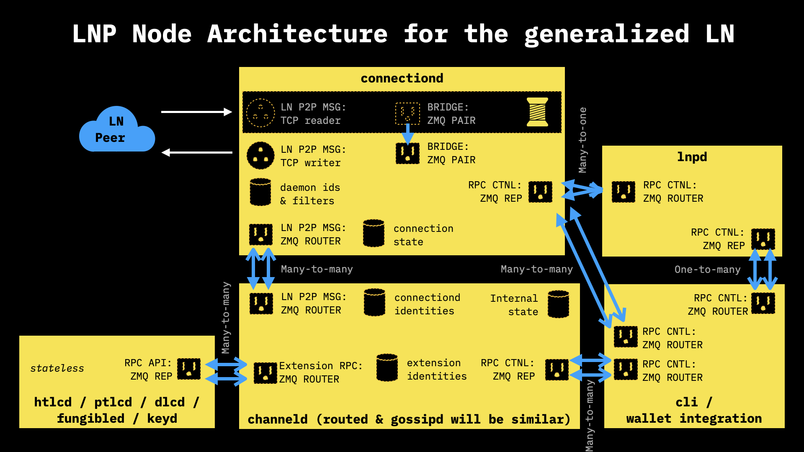
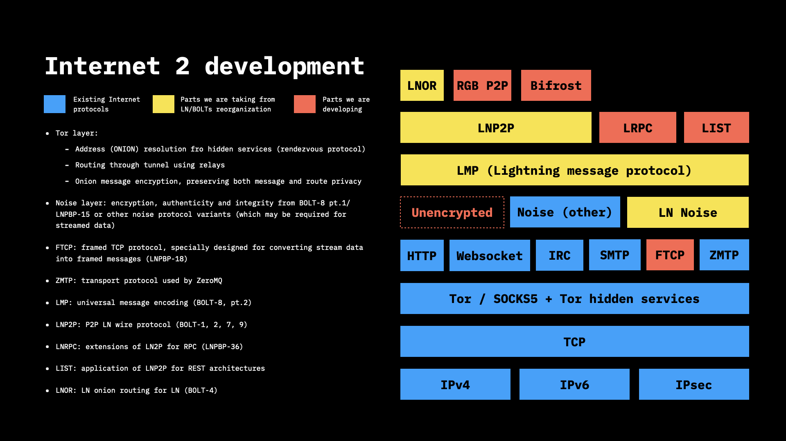

# Developer calls

## Intro

:clock5: Time and day - bi-weekly, on Wednesdays, 5pm CET\*\
&#x20;:link: Jitsi link to join the call [https://meet.jit.si/RGBcall1](https://meet.jit.si/RGBcall1)\
&#x20;:headphones: Calls are being recorded and uploaded to the [devcalls repository](https://github.com/LNP-BP/devcalls)\
&#x20;  🎥  Demos and presentations are uploaded to the [YouTube channel](https://www.youtube.com/c/LNPBP/)\
\
\*sometimes time and date can be changed, follow the announcements on [RGB Telegram Group](https://t.me/rgbtelegram)

## 2022-03-09

**Agenda**:\
1\. Presentation of a 🔥[ **dedicated initiative for support of 🇺🇦Ukraine internet, mobile and mesh network infrastructure; development of alternative bitcoin- & lightning-based payment and messaging methods.**](https://youtu.be/3p7gMMNIr7I)****

2\. Presentation of the **🔥**[**2022 roadmap towards a release**](https://youtu.be/9uI-5IAlzqo), pinpointing ways of how anyone can contribute.

3\. Q\&A session:\
\- NFT over LN use case\
\- algorithmical stable coin use case\
\- Since hashrate follows price, could hashrate or difficulty be used to peg a stablecoin? \
\- Are there any plans for a daemon management utility for desktop or servers (without needing systemd)? \
\- We tried to derive from the 'seed phrase' the bitcoin addresses (from descrptor wallet), but we couldn't find out which derivation path was used.  So question: how to calculate the correct descriptor wallet addresses based on the seed? \
\
🎧 [Audio recordings](https://github.com/LNP-BP/devcalls/commit/1b64099503c2ec5cb7bcec149fd213daf0ae82a7), 🎥 [YouTube video](https://youtu.be/9uI-5IAlzqo), 📝[ Presentation slides](https://github.com/LNP-BP/presentations/blob/master/Presentation%20slides/RGB%20roadmap%20to%20release%202022.pdf)

## 2021-12-22

**Agenda:**\
During the call we had the **third part** of the presentation and demonstration our 🔥[**LNP Node**](https://github.com/LNP-BP/presentations/blob/master/Presentation%20slides/LNP%20Node%20demo%20December%202021.%20Part%20III.pdf) (Lightning Network node written in Rust🦀 ). We managed to open the first Lightning network channel from LNP Node to a remote c-Lightning; on **Bitcoin mainnet**.\
\
Q\&A session questions:\
1\. When will Bifrost be released?\
2.I noticed you recommended bip43 purpose keys - will you also support bip44 hardened keys?\
3\. will there be a demo on the smart contract part of rgb anytime soon? if not how far away are we?\
4\. How big is the team?\
\
🎧 [Audio recordings](https://github.com/LNP-BP/devcalls/commit/1754d89e048a0272461184909b80592b6a954256), 🎥 [YouTube video](https://youtu.be/8VTB37VdeSg), 📝[ Presentation slides](https://github.com/LNP-BP/presentations/blob/master/Presentation%20slides/LNP%20Node%20demo%20December%202021.%20Part%20III.pdf)

## 2021-12-15

**Agenda:**\
During the call we had the **second part of the presentation and demonstration our** 🔥[**LNP Node**](https://github.com/LNP-BP/presentations/blob/master/Presentation%20slides/LNP%20Node%20demo%20December%202021.%20Part%20I%20%26%20II.pdf) **** (Lightning Network node written in Rust 🦀 ):\

- technical deep dive on the node’s internals\
\- its interoperability with LN\
\- its connection to c-lightning node\
\
Q\&A session questions:\
1\. Really interested in PTLC and how it would be possible to work with it using LNP Node.\
2\. Is the LNP Node a prerequisite to building a Rust compiler?\
3\. What is the reason of maintaining the backwards compatibility between Bifrost and 'legacy LN'?\
4\. Given different primitives that would allow you to tap into Lightning for liquidity; and because of the way RGB is built, you can build a multisig and bunch of signers of a particular issuance of an asset, and then there can be someone else who can issue another type of asset and he also has the whole setup. Is there any format or way to talk across these issuances so that you could do interesting things cross-asset?\
\
🎧 [Audio recordings](https://github.com/LNP-BP/devcalls/commit/f66693ee6d0228eb9aa6bd3db74f168110108000), 🎥 [YouTube video](https://youtu.be/L6JlIQXbl6Y), 📝[ Presentation slides](https://github.com/LNP-BP/presentations/blob/master/Presentation%20slides/LNP%20Node%20demo%20December%202021.%20Part%20I%20%26%20II.pdf)

## 2021-12-08

**Agenda:**\
1\. Second part of the demo of 🔥[**Descriptor wallet**](https://github.com/LNP-BP/presentations/blob/master/Presentation%20slides/Descriptor%20wallet%20demo%201st%20Dec%202021.pdf) **** (using Bitcoin mainnet and Taproot-enabled addresses). For more details check https://github.com/LNP-BP/descriptor-wallet\
Transactions publicly made for the first time by the descriptor wallet, on **Bitcoin mainnet** **to 2 Taproot addresses:**\
https://blockstream.info/tx/d4add20c23f46295763a1167044afa9e189cd91b68d3da99e737062b4f5e3202?expand\
https://blockstream.info/tx/d4302e3f0bbfc2b89798fd672fb806b52b4fa45044a39dd5302fece65e229aa6?expand\
\
2\. First part of 🔥 **** [**LNP Node demo**](https://github.com/LNP-BP/presentations/blob/master/Presentation%20slides/LNP%20Node%20demo%20December%202021.%20Part%20I%20%26%20II.pdf) **** and presentation on its internals and changes that have been made to it over the past weeks.\
Q\&A session questions:\
1\. I had problems compiling to WASM in past versions, there are some plan to compile to WASM in the future?\
2\. For next CLI devcalls. can we have the material to compile to follow your presentation?\
\
🎧 [Audio recordings](developer-calls.md#intro), 🎥 [YouTube video](https://youtu.be/DoNfKLLjzsY), 📝[ Presentation slides](https://github.com/LNP-BP/presentations/blob/master/Presentation%20slides/LNP%20Node%20demo%20December%202021.%20Part%20I%20%26%20II.pdf)

## 2021-12-01

**Agenda:**\
Dr. Maxim Orlovsky gives a presentation and the first part of demonstration of the 🔥[**Descriptor wallet with Taproot support**](https://github.com/LNP-BP/presentations/blob/master/Presentation%20slides/Descriptor%20wallet%20demo%201st%20Dec%202021.pdf) - explained its technical architecture and used Bitcoin mainnet. Descriptor wallet repository for more details https://github.com/LNP-BP/descriptor-wallet\
Q\&A session:\
1\. What are input descriptors?\
\
🎧 [Audio recordings](https://github.com/LNP-BP/devcalls/commit/cf0053c9675a392f455bd19e16b68db54f202261), 🎥 [YouTube video](https://youtu.be/2tiD\_gnpzQ0), 📝[ Presentation slides](https://github.com/LNP-BP/presentations/blob/master/Presentation%20slides/Taproot%20single-use-seals.pdf)

## 2021-11-17

**Agenda:**\
Dr. Maxim Orlovsky describes 🔥[**Taproot, Bitfrost and single-use seals**](https://www.youtube.com/watch?v=B\_3ntBI8x40)**,** the changes that are brought by Taproot and Bifrost (Generalised Lightning Protocol) to the single-use seals and many core RGB design principles. Peter Todd, Giacomo Zucco, Federico Tenga and many others gave their feedback and approval on various matters.\
\
🎧 [Audio recordings](https://github.com/LNP-BP/devcalls/commit/2d94201116f65e886a69fa53175a9838ea4895db), 🎥 [YouTube video](https://youtu.be/B\_3ntBI8x40), 📝[ Presentation slides](https://github.com/LNP-BP/presentations/blob/master/Presentation%20slides/Taproot%20single-use-seals.pdf)

## 2021-11-03

**Agenda:**

1\. Introduction and tech dive into 🔥[**Bifrost protocol**](https://github.com/LNP-BP/presentations/blob/master/Presentation%20slides/Bifrost.pdf)**.**\
2\. Q\&A session:\
\- Are the new LNPBPs already written? \
\- Will the number of different channel types become ever a problem - for example, must every node have channels of each types to use them?\
\-  I've understood that it's going to be released at the end of the year, what is going to be released exactly (sorry if it is said, but i lost the sound sometimes)?\
\- As a not hard core developer it's difficult to imagine the use cases, could we start a brainstorm with some people what kind of dreams we will accomplish? \
\- Are there working examples of some RGB operations over Bifrost? Can i work my way to make some RGB transfers in Bifrost with the code published now? \
\- How will nodes be incentivised to store Bifrost data?\
\- Why is it not possible to keep using a legacy channel with the legacy LN connection when you upgrade the channel to Bifrost ? What makes it impossible to "separate states" between legacy and Bifrost transactions?\
\-  I guess ANYPREVOUT would be very nice for Bifrost? What about other possible bitcoin future softforks?\
\
🎧 [Audio recordings](https://github.com/LNP-BP/devcalls/commit/d3113b6d6f96017c757832fe9c0a40204bd434b7), 🎥[ YouTube video](https://youtu.be/fTrY74G5-G8), 📝[ Presentation slides](https://github.com/LNP-BP/presentations/blob/master/Presentation%20slides/Bifrost.pdf)

## 2021-09-22

**Agenda:** \
****Q\&A session

* Is the amount of UTXO, to which a specific RGB asset is assigned, a hidden or public information&#x20;
* My question is about RGB Node, now is break for the updating in RGB Core and RGB-20, is going to be released updated soon? It's going to have much change respect what we have today, apart from adapting to changes in another libraries?&#x20;
* What is the link between AluVM and Contractum?&#x20;
* AluVM will be included on the next reales and be required to run RGB? How RGB-20 is impacted? Can we say AluVM is the current way to do client-side validation?&#x20;
* Does Bitcoin Pro have to be updated for AluVM?&#x20;
* In your opinion, what would be the better way to implement LLVM IR to AluVM bytecode? LLVM IR compiling to bytecode or (as you mentionned in a previous call) LLVM IR translated into ALU asm via parser? Or other way like o a Rust pest project? (LLVM IR -> Aluasm). Same questions for WASM - AluVM&#x20;
* Can RGB be compatible with ZK-Rollups? I understand Roll-up is not preferred. But is it viable as an immediate interim solution to bring already built solutions to RGB before pure client side validation is built?&#x20;
* Is the unowned state is still a subject? What is it exactly?&#x20;
* What is a valency in the context of RGB?&#x20;
* What is the state of LNP in the scope of RGB? How is client-side validation done with LN? Is Francisco ready to dive in this?&#x20;
* If I have RGB assets assigned to a Bitcoin UTXO and I want to run this UTXO in a CoinJoin, what will happen? Will I loose my RGB assets?\
  \
  🎧 [Audio recordings](https://github.com/LNP-BP/devcalls/commit/fa676f4625c55c43b1e98034eb7d6fd7640c4594)

## 2021-09-08

**Agenda:**\
1\. Presentation on 🔥[**RGB roadmap: a way towards release**](https://youtu.be/CCfZjbaju7g).\
2\. Q\&A session:\
\- Will the exchange rate be always RGB-token/BTC or you there will be RGB-token1/RGB-token2?\
\- I have the impression that MyCitadel wallet is IOS/macOS only...is that true? \
\- Do you expect any resistance to current nodes switching to Bifrost? \
\- How the main lightning implementations devs received the idea to add Bifrost to their own implementation? \
\- Do you recommend the use of rust-lightning? \
\- What is the risk of keeping all data on Bifrost instead of locally? Just fees for storage? \
\- What would be the incentive to run a Bifrost node? \
\- What happens if we do not have capacity to receive data locally are we aren't using Bifrost? Does transaction get rejected?\
\- How is the data availability ensured with some/many nodes going offline?\
\- Will MyCitadel beta be back soon? Or do you plan to release the first non beta version along with RGB in the end of the year? \
\- What happens if the client-side data is lost (worst case scenario)?  Would it affect any smart contract applications? \
\- To come back to the exchange rate rgb-token/BTC vs rgb-token1/rgb-token2, the principle of "coincidence of wants" would point that it would be more efficient and profitable to price anything into the hard money, aka BTC, as you would have more liquidity and that if you want to go from RGB-token1 to RGB-token2, you would have better offers if you do an indirect exchange through BTC.\
\- What are the limitations of client-side validation?\
\
🎧 [Audio recordings](https://github.com/LNP-BP/devcalls/commit/7695b486e5c1ee44d2a51df425ab73d800068238), 🎥 [YouTube video](https://youtu.be/CCfZjbaju7g), 📝 [Presentation slides](https://github.com/LNP-BP/presentations/blob/master/Presentation%20slides/RGB%20Roadmap%202021.pdf)

## 2021-08-25

**Agenda:**\
1\. Presentation of 🔥[**AluVM Assembly, compiler and linker demo**](https://youtu.be/1t0Uph5bsLo).\
2\. Q\&A session\
\- How do I do to have the syntax colors for the asm in the IDE?\
\- Are there any working examples of RGB smart contracts written in Contractum?\
\
Links from the call:\
\- [https://github.com/pandoracore/aluasm](https://github.com/pandoracore/aluasm)\
\- [https://github.com/rgb-org/rust-rgb20](https://github.com/rgb-org/rust-rgb20)\
\
🎧 [Audio recordings](https://github.com/LNP-BP/devcalls/commit/b1d917555685ca1880741831e35c0af128e64e8c), 🎥 [YouTube video](https://youtu.be/1t0Uph5bsLo)

## 2021-08-04

**Agenda:**\
Presentation of 🔥 **** [**RGB programmability**](https://youtu.be/iyDCdGQ-pTY) **-** how to design and program RGB smart contracts.\
\
🎧 [Audio recordings](https://github.com/LNP-BP/devcalls/commit/9e0350cfb859e3370b1e10355e9906a24d432007), 🎥 [YouTube video](https://youtu.be/6Gj4v7ZjPwQ), 📝 [Presentation slides](https://github.com/LNP-BP/presentations/blob/master/Presentation%20slides/RGB%20Programmability.pdf)

## 2021-07-21

**Agenda:**\
1\. Presentation of 🔥[**RGB computational model (PRISM)**](https://www.youtube.com/watch?v=1EtNwRLE3Bc\&t=3821s).\
2\. Q\&A session:\
\- How badly Disclosure process exposes your privacy?\
\- If RGB smart contracts are isolated, can they still cooperate/share information between each other?\
\- If in Stash many parties can contain alternative histories, how to define which history is the true one?\
\- I believe that the RGB20 and RGB21 contracts written in rust already existed before AluVM, will there be a reimplementation of RGB20 and RGB21 in AluVM scripts?\
\- Do you have any further insight into when RGB will work on lightning?\
etc\
\
🎧 [Audio recordings](https://github.com/LNP-BP/devcalls/commit/f8d11cb8f9d0e5fd38f2f3fb4476f9d0e1047b88), 🎥 [YouTube video](https://www.youtube.com/watch?v=1EtNwRLE3Bc\&t=3821s), 📝 [Presentation slides](https://github.com/LNP-BP/presentations/blob/master/Presentation%20slides/PRISM%20-%20RGB%20computing%20model.pdf)

## 2021-07-14

**Agenda:**\
Development update and RGB Q\&A session.\
1\. Category Theory resources:[ introductory course](http://math.mit.edu/\~dspivak/teaching/sp18/), [additional link](https://research.protocol.ai/areas/applied-category-theory/).\
2\. Does category theory has impact on AluVM?\
3\. Is there a standard in RGB (or bitcoin) in denoting a utxo output e.g. in a single use seal?\
4\. Does a routing node just need to know about the asset, or do the channels have to be for that RGB asset as opposed to regular NTC LN channels?\
5\. If an asset created with RGB becomes very valuable, or you just have many of them, you might not want to have it on a lightning hot wallet. Since to move the assets, only a regular BTC signature on a PSBT is required, it should be possible to safeguard those assets in the same cold storage as your regular BTC. The only hard requirement to the cold storage is that it can sign PSBTs. I don't think there should be a problem with multisig here. But in order to be sure you sign the right thing, the cold storage should have some knowledge of the assets that are moved. How could this look like?\
6 . If i'm reckless, can I use RGB on mainnet? Is there any precedent of issuing rgb asset on mainnet?\
7\. There is an idea to put a NFT (the RGB equivalent) in an Opendime to transfer some properties physically. So, on the Opendime attached on the artwork you will have the NFT certificate version of the artwork. Can it be possible with RGB NFTs?\
8\. RGB and existing Lightning Nodes implementations (e.g. LND).\
9\. DEX devepoment - progress update.\
\
🎧[ Audio recordings](https://github.com/LNP-BP/devcalls/commit/ed6a8976686ab16e84a98ea910f7bee75b438151)

## 2021-06-30

**Agenda:** \
1\. Development and documentation updates.\
\- [https://github.com/orgs/rust-bitcoin/projects/3](https://github.com/orgs/rust-bitcoin/projects/3)\
\- [https://standards.lnp-bp.org](https://standards.lnp-bp.org)\
\- [https://strict-encoding.lnp-bp.org](https://strict-encoding.lnp-bp.org)\
\- [https://blueprint.rgb.network](https://blueprint.rgb.network)\
\- [https://www.rgbfaq.com](https://www.rgbfaq.com)\
2\. Q\&A session:\
\- How to solve the double issuing problem when the issuing is private?\
\- Will there be a vanity asset id generator? (vanity = with friendly first asset id characters)\
\- How can AluVM optimize or control the behavior of assets in a lightning channel?\
\- Is it possible to use AluVM to write an auction contract "using sats" or bidding?\
\- Can you talk more about the decentralized data storage for RGB21? Who pays for the storage and who will pay for it in the future?\
3\. Preliminary introduction of the research on [Sigchain and Sealchain ](https://github.com/pandora-network)carried out by Dr. Maxim Orlovsky and Pandora Core AG.\
\
🎧 [Audio recordings](https://github.com/LNP-BP/devcalls/commit/f2da5a9dd2fb0f26dca63edafe237666c01ed8b5)

## 2021-06-16

**Agenda:**\
Presentation on 🔥[**Taproot status, its implementation in Rust Bitcoin and Lightning Network upgrades required for Taproot support.**](https://github.com/LNP-BP/presentations/blob/master/Presentation%20slides/Taproot%20status%20report%20Jun%202021.pdf)****\
****\
****We also gave an overview of the possibilities it brings to the LNP/BP stack & ways the LNP/BP Standards Association and Pandora Core AG contribute to Taproot's development.

🎧 [Audio recordings](https://github.com/LNP-BP/devcalls/commit/bf785257d083c6208896a924892f0ccf034a22e0), 📝 [Presentation slides](https://github.com/LNP-BP/presentations/blob/master/Presentation%20slides/Taproot%20status%20report%20Jun%202021.pdf)

## 2021-06-09

**Agenda:**\
Presentation of 🔥[**AluVM and its runtime environments**](https://github.com/LNP-BP/presentations/blob/master/Presentation%20slides/AluVM.pdf)****[ **** ](https://github.com/LNP-BP/presentations/blob/master/Presentation%20slides/AluVM.pdf).\
\
🎧 [Audio recordings](https://github.com/LNP-BP/devcalls/commit/47d8f0186e842b7ce92df607eff158dd12a5a05a), 🎥 [YouTube video](https://youtu.be/brfWta7XXFQ), 📝 [Presentation slides](https://github.com/LNP-BP/presentations/blob/master/Presentation%20slides/Single-use-seals.pdf)

## 2021-06-01

**Agenda:**\
1\. Presentation on 🔥 **** [**Single-use seals concept**](https://github.com/LNP-BP/presentations/blob/master/Presentation%20slides/Single-use-seals.pdf), how it is used in RGB.\
2\. Brief discussion on DID held as an example of how single-use seals can be applied there (with [Christopher Allen](https://twitter.com/ChristopherA) from Blockchain Commons/Blockstream joining us).\
\
🎧 [Audio recordings](https://github.com/LNP-BP/devcalls/commit/41f9b6cedc08f0644e1dd9c9cc2d8a55ad01a497), 🎥 [YouTube video](https://youtu.be/gGPLYfWOb\_8), 📝 [Presentation slides](https://github.com/LNP-BP/presentations/blob/master/Presentation%20slides/Single-use-seals.pdf)

## 2021-05-26

**Agenda:**\
1\. Description of the features that are already a part of RGB and the ones that are going into production with new release.\
2\. Q\&A session:\
\- Mainnet/testnet/signet in Bitcoin and LN - RGB perspective. \
\- Bifrost - what’s the idea and functionality of it?\
\- Is RGB in production?\
\- When RGB mainnet?\
\- Why is the smart contract system part of the MVP when it was not needed before?\
\-  Is simplicity going to be used? \
\- What is this contractum? Is it a yet another completely new thing?\
\- Plans for the following months.\
\- How to track RGB progress and contribute to it.\
etc\
\
🎧 [Audio recordings](https://github.com/LNP-BP/devcalls/commit/28cbe7b906841f821abf9cdb6f85288a33ddcdda)

## 2021-05-19

**Agenda:**\
Presentation of 🔥 [**AluVM** ](https://youtu.be/Mma0oyiVbSE)(virtual machine developed by Dr. Maxim Orlovsky for RGB) and overall computing that can be possible with RGB & Schema.\
\
🎧 [Audio recordings](https://github.com/LNP-BP/devcalls/commit/f905c1da9c60833d5773f7e44b6d57ef154c9e40), 🎥 [YouTube videos](https://youtu.be/Mma0oyiVbSE) 📝 [Presentation slides](https://github.com/LNP-BP/presentations/blob/master/Presentation%20slides/RGB%20smart%20contracts%20computing%20-%20AluVM%20and%20Schema.pdf)

## 2021-05-12

**Agenda:**\
1\. Technical updates on the development ([client-side validation repo](https://github.com/LNP-BP/client\_side\_validation)).\
2\. Q\&A session:\
\- Have you thought about bad actors trying to patent stuff, like someone sees something in here and then tries to patent it?\
\- What are the time estimates and release dates of Storm, Bifrost and other components?\
\- Do you need Taproot?\
\- Does lightning support have external dependencies like smth needs to happen in Bitcoin Core or elsewhere (like rust-bitcoin) in order to enable lightning for RGB?\
\- Smart-contracts and client side validation - RGB POV and high level explanations.\
\- Are you planning a future conference?\
\- Do you have plan to work on "channel factories" ?\
etc\
🎧 [Audio recordings](https://github.com/LNP-BP/devcalls/commit/f94c16b5660bfc3019c74d718700375526f82e25)

## 2021-05-05

**Agenda:**\
\
Presentation on 🔥 [**RGB 2021 roadmap & beyond**](https://github.com/LNP-BP/presentations/blob/master/Presentation%20slides/RGB%20Roadmap%202021%20and%20beyond.pdf)**:**\
1\. Technical details behind new version of client-side-validation library.\
2\. Updates on deterministic bitcoin commitment standards.\
3\. Thoughts on RGB layers & LightningNetwork (LN dissection).\
4\. LNP/BP technical roadmap\
\
🎧 [Audio recordings](https://github.com/LNP-BP/devcalls/commit/80432680fd5a07f9a40c4d73f6ac625a54b26164), 🎥 [YouTube videos](https://www.youtube.com/playlist?list=PLG6aOZYXJo--tTuWCVluws6aVnX8xWJV9) 📝 [Presentation slides](https://github.com/LNP-BP/presentations/blob/master/Presentation%20slides/RGB%20Roadmap%202021%20and%20beyond.pdf)

## 2021-04-28

**Agenda:**

Community-driven call, where community members tried to install [RGB Node](https://github.com/rgb-org/rgb-node), issue assets using [CLI tools](https://www.youtube.com/watch?v=d0MjmcCmegs\&t=951s\&ab\_channel=LNPBPStandardsAssociation) and [Bitcoin Pro](https://github.com/pandoracore/bitcoin-pro), transfer assets from Bitcoin Pro to [MyCitadel wallet](https://github.com/mycitadel) after downloading it from [Testflight](https://testflight.apple.com/join/ZL24hlk7) etc.\
\
🎧 [Audio recordings](https://github.com/LNP-BP/devcalls/commit/df536c76f2b70bba529f3bf675f3acdf1e54ab13), 🎥 [YouTube videos](https://youtube.com/playlist?list=PLG6aOZYXJo-\_g4zqL7jl1uIZzurdPWqWe)

## 2021-04-07

**Agenda:**\
Presentation on 🔥[ **RGB Identity, Naming and Reputation**](https://youtu.be/swtr7pwWUhY)****\
****\
****🎧 [Audio recordings](https://github.com/LNP-BP/devcalls/commit/6e110949a57fd68c1316dfc0a56ff53ba099d5dd), 🎥 [YouTube videos](https://youtu.be/swtr7pwWUhY) 📝 [Presentation slides](https://github.com/LNP-BP/presentations/blob/master/Presentation%20slides/RGB%20Digital%20Identity%2C%20Naming%20%26%20Reputation.pdf)

## 2021-03-31

**Agenda:**\
1\. RGB v.1 and RGB v.2 overview.\
2\. Development updates:\
\- Completing the development of disclosures\
\- Use cases for burn & replacement procedure\
\- NFT progress\
\- Subschema for simplified RGB20 asset without replacement procedure\
\- Data containers API\
\- RGB20 secondary issuance\
\- Improving and extending general API to work with state transitions etc\
\
3\. Virtualisation of RGB validation rules:\
\- What is RGB client-side validation?\
\- Schema & scripting\
\- **Introduction of** 🔥 **** [**AluVM and Contractum language**](https://www.youtube.com/watch?v=JmKNyOMv68I\&ab\_channel=LNPBPStandardsAssociation)****\
****\
****🎧 [Audio recordings](https://github.com/LNP-BP/devcalls/commit/48b2a9bfea0cdc6b758f93973ea6cbd1d54f0174), 🎥 [YouTube videos](https://youtu.be/JmKNyOMv68I) 📝 [Presentation slides](https://github.com/LNP-BP/Presentations/blob/master/Presentation%20slides/RGB%20VM%20%26%20scripting.pdf)

## 2021-03-24

**Agenda**\
**NFT-related RGB Schemata & protocols** presentation: \
&#x20;1\. Implementation progress & updates. \
&#x20;2\. Moving from genesis-based information transmission to consignment-based. \
&#x20;3\. Subschemata: overview and usage in RGB20 use case. \
&#x20;4\. Anarchic DRM systems. \
&#x20;5\. How to sell usage rights without onchain transactions. \
&#x20;6\. Introduction of Data containers. \
&#x20;7\. Introduction to Bifrost. \
&#x20;8\. Virtualization of client-side validation.\
\
🎧 [Audio recordings](https://github.com/LNP-BP/devcalls/commit/6c115faa4126849793a718c9d3667bbb1696e304), 🎥 [YouTube videos](https://www.youtube.com/playlist?list=PLG6aOZYXJo-\_-EjEflPgNJzZ8kyZI\_FPq) 📝 [Presentation slides](https://github.com/LNP-BP/Presentations/blob/master/Presentation%20slides/NFT-related%20RGB%20Schemata%20%26%20protocols.%2024th%20March%202021.pdf)

## 2021-03-18

**Agenda:**\
**Building RGB adoption** presentation:\
\- Intro. RGB vs Ethereum and 'Multi blockchain world'\
\- RGB mission & core drivers for its adoption\
\- LNP/BP Association tools\
\- Internet 2 architecture\
\- Bitcoin Pro, Citadel SDK, MyCitadel Node, MyCitadel box, MyCitadel cloud\
\- Introduction of 🔥 [**RGBex.io**](https://rgbex.io) - the first RGB explorer for publishing and sharing information about your assets\
\- Dev vacancies & Fundraising info\
\
🎧 [Audio recordings](https://github.com/LNP-BP/devcalls/commit/4f3c7508e47dd753777517bc4576dff3cd884d1a), 🎥 [YouTube videos](https://www.youtube.com/playlist?list=PLG6aOZYXJo--Ll2CqfoPTS0Z70fHGVGHC) 📝 [Presentation slides](https://github.com/LNP-BP/FAQ/blob/master/Presentation%20slides/Building%20RGB%20ecosystem.pdf)

## 2021-03-10

**Agenda:**\
1\. Double consignments updates\
2\. Disclosures [https://github.com/rgb-org/rgb-core/pull/26](https://github.com/rgb-org/rgb-core/pull/26)\
3\. Multiple asset transfers[ rgb-org/rgb-node#148](https://github.com/rgb-org/rgb-node/pull/148)\
4\. Revealed-merge procedure [rgb-org/rgb-core#23](https://github.com/rgb-org/rgb-core/pull/23)\
5\. Command-line tools:\
\- PSBT\
\- RGB\
\- Invoice\
\
🎧 [Audio recordings](https://github.com/LNP-BP/devcalls/commit/9461b920001b7e07ea8c562f28815909fd75e892)

## 2021-03-03

**Agenda:**\
🔥[**MyCitadel Wallet Beta release**](https://github.com/mycitadel)\
\
🎧 [Audio recordings](https://github.com/LNP-BP/devcalls/commit/57bb05bd8c1e3b4f2f39b2d25b79aa0273d88045), 🎥 YouTube videos \[WIP]

## 2021-02-24

**Agenda:**

1. Development updates from @dr-orlovsky:
   * wallet architecture advancements
   * plans & roadmap for more testing command-line, tx-generation and wallet-based tools
2. Recap on transition mutability refactoring on the previous week
3. Review of quality assurance issues from [https://github.com/orgs/rgb-org/projects/11](https://github.com/orgs/rgb-org/projects/11), pay special attention to consignment merges
4. Priorities for further development process
5. Developer Q\&As
6.  Update Stash merge logic to account for previously known transition data. This is a security vulnerability and can cause fund loss. Ref: [https://github.com/rgb-org/rgb-node/pull/136#issuecomment-782355933](https://github.com/rgb-org/rgb-node/pull/136#issuecomment-782355933)

    Ref PR: [https://github.com/rgb-org/rgb-node/pull/137#issue-579380172](https://github.com/rgb-org/rgb-node/pull/137#issue-579380172)

🎧 [Audio recordings](https://github.com/LNP-BP/devcalls/commit/0d0d1ed6d1955c2beb33ef249500e13430bd1973)

## 2021-02-17

**Agenda:**\
RGB NFT Q\&A\
1\. How you transfer 1 of 1 tokens on LN since by definition there's no liquidity?\
2\. Will moving digital art RGB tokens require escrow channels?\
3\. Are multi-asset channels something that is possible to use with fungible assets and NFTs? Are they implemented? How do they work?\
4\. Multi-peer channels and multi-hop payments - how can they work in NFT case (if they can)? \
5\. How you deal if somebody lost his token for his art-piece ? How do you issue a new one?\
6\. Why try to link real world assets with NFTs ?

RGB Q\&A\
1\. Could we use RGB tokens as representing the state in a more complex state machine ? A state machine that could be represented by a Directed Graph (allowing cycles), a general petrinet for example.\
2\. If you lend your bitcoin to some financial institution and then something happens to it, can you use the RGB-bearer right to prove that you are still the holder of bitcoin and get your funds back?

DEMO\
Demo of a command-line :fire:****[**MyCitadel node**](https://github.com/mycitadel/mycitadel-node) **** - the wallet's node and command-line interface of it.  🎥 [YouTube video](https://youtu.be/d0MjmcCmegs)\
\
🎧 [Audio recordings](https://github.com/LNP-BP/devcalls/commit/36f7962e18d53ac0be88b4a88af10449206b89f7)

## 2021-02-10

**Agenda:** \
RGB QA session\
****Issues from **** [https://github.com/orgs/rgb-org/projects/11](https://github.com/orgs/rgb-org/projects/11)

1. Properly handle result from 'validate' request to Stash daemon - [https://github.com/rgb-org/rgb-node/issues/132](https://github.com/rgb-org/rgb-node/issues/132)
2. Asset state transition node ID mutability
   * [https://github.com/rgb-org/rgb-node/issues/133](https://github.com/rgb-org/rgb-node/issues/133)
   * [https://github.com/rgb-org/rgb-node/pull/131](https://github.com/rgb-org/rgb-node/pull/131)
   * Asset transfer validation is ineffective: [https://github.com/rgb-org/rgb-node/issues/130](https://github.com/rgb-org/rgb-node/issues/130)
3. Question about fungible asset known allocations semantics - [https://github.com/rgb-org/rgb-node/pull/134](https://github.com/rgb-org/rgb-node/pull/134)
4. Transfer change allocation not being registered - [https://github.com/rgb-org/rgb-node/pull/129](https://github.com/rgb-org/rgb-node/pull/129)
5.  Transaction output duplicated by 'fungible transfer' - [https://github.com/rgb-org/rgb-node/issues/127](https://github.com/rgb-org/rgb-node/issues/127)\

    Wallet integration

    * RGB derivation paths
    * where to keep the blinding secrets
    * use of descriptor-based invoices
    * invoice updates supporting recurrent payments & donations
    * dedicated tweaked key derivation path
    * wallet integration abstraction layers\

    Wallet demo

    * what is MyCitadel node and its command-line interface [https://github.com/mycitadel/mycitadel-node](https://github.com/mycitadel/mycitadel-node)
    * support for taproot
    * support of legacy and novel wallet contracts, BIP identity proposal
    * creation of a single-sig wallet contract
    * detecting UTXOs
    * issuing RGB assets to the wallet-controlled output\

    Documentation

    * LNP Node demo updates by Step - [https://github.com/LNP-BP/lnp-node/pull/35](https://github.com/LNP-BP/lnp-node/pull/35)
    * Validation UML sequence diagram by @raj [https://github.com/rgb-org/uml/pull/2](https://github.com/rgb-org/uml/pull/2)
    * RGB demo workflow diagram [https://github.com/LNP-BP/devcalls/issues/33](https://github.com/LNP-BP/devcalls/issues/33)

    \
    \
    🎧 [Audio recordings](https://github.com/LNP-BP/devcalls/commit/b14abf192fb3a33b294091c6c53ddd2d7748acc4)

## 2021-02-03

**Agenda:**\
1\. Brief demo of RGB working with real-life software ([Bitcoin Pro](https://github.com/pandoracore/bitcoin-pro) tool and WIP on MyCitadel wallet that are being developed by [Pandora Core](https://github.com/pandoracore)).\
2\. Proposal to create standards that would cover the ways to visually represent the client-side functionality that is not a part of Core RGB Library and protocol.\
3\. Technical update on the progress.\
4.[ RGB workflow diagram.](https://github.com/rgb-org/FAQ/discussions/1) \
5\. [Android bounty bug.](https://github.com/rgb-org/rgb-sdk/issues/51)\
6\. Other bugs and issues raised by the core dev team and external contributors.\
\
🎧 [Audio recordings](https://github.com/LNP-BP/devcalls/commit/c30f6f4bb897b62f039f266336a8fa5cf7bd4579)

## 2021-01-27

**Agenda:**\
Presentation on :fire:****[**RGB Wallets integration**](https://www.youtube.com/playlist?list=PLG6aOZYXJo-\_N2BA-v2MRKoo2u7erJ7SP), that covers:\
\- diagrams explaining how the wallet part of the business logic, storage etc. should be done in order to use RGB SDK;\
\- PSBT structure required for RGB work with hardware wallet;\
\- universal invoices updates;\
\- use of Bech32 encodings in RGB & LNP/BP tech stack.\
\
🎧 [Audio recordings](https://github.com/LNP-BP/devcalls/commit/68a773c7c61ad97182a5398e9bb460b717b090eb), 🎥 [YouTube videos](https://www.youtube.com/playlist?list=PLG6aOZYXJo-\_N2BA-v2MRKoo2u7erJ7SP) 📝 [Presentation slides](https://github.com/LNP-BP/FAQ/blob/master/Presentation%20slides/RGB%20Wallet%20Perspective%20-%202021Q1.pdf)

## 2021-01-20

**Agenda:**\
1\. Dev Updates and future roadmap (see the slides):\
\- Updates on related projects: rust-bitcoin & rust-miniscript\
\- Updates on refactoring LNP/BP Core Lib and info on new crates (wallet descriptors, RGB Core, LNP Core, Internet2)\
\- Moving repositories into project-specific github orgs (RGB-org, Internet2-org)\
\- v0.3.0 release of LNP/BP Core Lib, RGB Core Lib & RGB Node\
\- New developments with LNP Core & BOLT-7 by [**@raj**](https://github.com/raj)****\
****- Proposed architecture for mobile wallets using RGB+LNP Node\
\- RGB/LN invoicing protocol: aspects related to mobile payment\
\
2\. Pending issues to discuss:\
\- [LNP-BP/LNPBPs#83](https://github.com/LNP-BP/LNPBPs/issues/83)\
\- [rgb-org/rgb-sdk#47](https://github.com/rgb-org/rgb-sdk/issues/47)\
\- [#33](https://github.com/LNP-BP/devcalls/issues/33)\
\
🎧 [Audio recordings](https://github.com/LNP-BP/devcalls/commit/b768501831a6c51bb0d75a8e344f800b948ca636), 🎥 [YouTube videos](https://www.youtube.com/playlist?list=PLG6aOZYXJo-\_ms-exOd3ppG7-65R5k45o) 📝 [Presentation slides](https://github.com/LNP-BP/FAQ/blob/master/Presentation%20slides/LNP:BP%20v0.3%20libraries.pdf)\

## 2021-01-13

**Agenda:**\
1\. 2021 Agenda for LNP/BP Standards Association:\
\- LNP SDK & improvements to RGB SDK; support first wallets & exchanges integrating RGB (SDKs & docs)\
\- Fundraising to support Association operations\
\- Completion of LNP/BP standards for RGB & related protocols: official RGB standard release\
\- Completion of LNP Node to fully support all LN features\
\- Bifrost protocol for public RGB infrastructure & decentralized exchange over LN\
\- Further development of Internet2 libraries; support of software using Internet2 tech stack\
\- BP Node: indexing node for bitcoin blockchain replacing need in Electrum\
\- Initial work on implementation of Lightspeed, Storm & Prometheus protocols\
\
2\. :fire: [**Presentation of the LNP/BP Core Lib BP module**](https://youtu.be/l5zs0smOXps)****\
****🎥  [YouTube video](https://youtu.be/l5zs0smOXps) and 📝 [Presentation slides](https://github.com/LNP-BP/FAQ/blob/master/Presentation%20slides/LNP:BP%20Core%20Library%20%E2%80%93%20BP%20module.pdf)\
\
3\. Discussion:\
\- Updates on related projects: rust-bitcoin & rust-miniscript\
\- Advanced descriptors with BP module of LNP/BP Core Lib\
\- Proposed architecture for mobile wallets using RGB+LNP Node\
\- RGB/LN invoicing protocol: aspects related to mobile payment\
\
🎧 [Audio recordings](https://github.com/LNP-BP/devcalls/commit/d40a738bab3d11a90e5b70119b4c473bd753229a)

## 2020-12-17

**Agenda:**\
1\. Docs & community\
\- [RGB Reddit](https://www.reddit.com/r/RGB\_protocol/)\
\- [RGB FAQ](https://rgbfaq.com) release \
2\. Releases\
\- [LNP Node v0.2 beta 2](https://github.com/LNP-BP/lnp-node/releases/tag/v0.1.0-beta.2): upgrade to LNP/BP Core lib release & bugfixing from @St333p\
\- [RGB Node v0.2](https://github.com/LNP-BP/rgb-node/releases/tag/v0.2.0) release\
\- [librgb v0.2 release candidate](https://github.com/LNP-BP/rgb-sdk/tree/master/librgb)\
\- RGB SDK updates\
3\. 💥 **** [**Universal LNP/BP invoices**](https://youtu.be/R1QudCywRGk) standard proposal presentation \
\
🎧 [Audio recordings](https://github.com/LNP-BP/devcalls/commit/e230c3f8a8ba08d1d1019852cb85935bc6cc5a2d),  🎥 [YouTube video](https://youtu.be/R1QudCywRGk) and 📝 [Presentation slides](https://github.com/LNP-BP/FAQ/blob/master/Presentation%20slides/Universal%20LNP-BP%20invoices.pdf)&#x20;

## 2020-12-09

**Agenda:**\
1\. Release of [**v0.2 of LNP/BP Core Library**](https://github.com/LNP-BP/rust-lnpbp/releases/tag/v0.2.0) **** 🔥\
****2. How will Taproot affect RGB?\
3\. Difference between Bitcoin Pro and MyCitadel wallet\
4\. WASM & bindings of RGB SDK\
5\. [Issue #31](https://github.com/LNP-BP/lnp-node/issues/31) - channel data inconsistency between peers\
6\. Brief introduction of [Generic invoices (BP+LNP+RGB)](https://github.com/LNP-BP/rust-lnpbp/pull/165/files#diff-432ec656a49ce84afd9b35d78927606bf91f5bcdcb736254df3141ed6eb8b1c4)\
\
🎧 [Audio recordings](https://github.com/LNP-BP/devcalls/commit/85bdb8a27fe740894ba07c406c418f3d4437b034)

## 2020-12-02

**Agenda:**\
1\. Presentation of [**Bitcoin Pro**](https://github.com/pandoracore/bitcoin-pro) **** 🔥\
2\. Technical discussion\
[\
](https://github.com/LNP-BP/devcalls/commit/6eb4b4c5d69707f4f589b0ca42721df33db0da2d)🎧 [Audio recordings](https://github.com/LNP-BP/devcalls/commit/6eb4b4c5d69707f4f589b0ca42721df33db0da2d) and 🎥 [YouTube videos](https://youtube.com/playlist?list=PLG6aOZYXJo-99Mx-RTkmw3o5wA7PW\_gQl)

## 2020-11-25

**Agenda:**\
1\. Updates from the call with Ledger\
2\. [RGB-21 Collectible Schema](https://github.com/LNP-BP/LNPBPs/blob/master/lnpbp-0021.md):\
&#x20;    \- Unique tokens & token-specfic data\
&#x20;    \- Issuance control\
&#x20;    \- Generic token data, internal or external, in different formats\
&#x20;    \- Engravings (and why Schema subclassing is required)\
&#x20;    \- LockUTXOs and descriptors for proof of reserves\
&#x20;    \- Renominations\
&#x20;    \- Rights splits\
[\
](https://github.com/LNP-BP/devcalls/commit/6eb4b4c5d69707f4f589b0ca42721df33db0da2d)🎧 [Audio recordings](https://github.com/LNP-BP/devcalls/commit/1fbb7e77bfbc6b11bb72c8bef544e5317e447dca)

## 2020-11-18

**Agenda:**\
1\. [RGB branding](https://github.com/LNP-BP/FAQ/tree/master/RGB%20Branding%20%26%20Logo)\
2\. Reduce asset name length limit - [Issue #74](https://github.com/LNP-BP/LNPBPs/issues/74)\
3\. Support for asset name registries - [Issue #75](https://github.com/LNP-BP/LNPBPs/issues/75)\
4\. PSBT and deterministic bitcoin commitments/public key tweaks - [Issue #69](https://github.com/LNP-BP/LNPBPs/issues/69)\
5\. RGB-20 Schema update:\
&#x20;    \- Removed dust limit\
&#x20;    \- Multiple inflation rights with better control over total inflation\
&#x20;    \- Epoch-based burn and burn-and-replace procedures; enhanced with UTXO set and versioned proofs of burn data, supporting up to 15 burn proof variants (+"no proofs" option)\
&#x20;    \- Asset renomination procedure, for changing asset names or splitting stock shares after @sabina\_sa proposal\
&#x20;    \- Standardisation of contract text URL and commitment format\
&#x20;    \- Rights split procedure\
\
🎧[ Audio recordings](https://github.com/LNP-BP/devcalls/commit/03f9931eb2ec3faaa44bc91b8366273f64906445)

## 2020-11-12

**Agenda:**\
1\. Reduce asset name length limit - [Issue #74](https://github.com/LNP-BP/LNPBPs/issues/74)\
2\. PSBT and deterministic bitcoin commitments / public key tweaks - [Issue #69](https://github.com/LNP-BP/LNPBPs/issues/69)\
3\. OP\_RETURN - is there still the need in it, should we support it? \
4\. Support of multiple assets and funding the LN channel with assets 'on the flight'\
5\. Solving the problem of American Call Option\
6\. Sign-to-contract and Pay-to-contract schemes\
7\. Simplicity language support in RGB (update)\
8\. Andrew Poelstra's work on bringing Buletproofs to lib secp256k1 (update)\
\
🎧[ Audio recordings](https://github.com/LNP-BP/devcalls/commit/451e228ea7660275d5f3b059381ed11d9fdd281f)

## 2020-11-05

**Agenda:**\
Demo of the[ **LNP Node 0.1 Alpha 4**](https://github.com/LNP-BP/lnp-node)🔥\
\
🎧 [Audio recordings](https://github.com/LNP-BP/devcalls/commit/2aa616bc21d2fff54d947cc6f399e66adc0ad04b) and 🎥 [YouTube videos](https://www.youtube.com/playlist?list=PLG6aOZYXJo-8WlwF21B-R5kzY8--ejsZP)

## 2020-10-28

**Agenda:**\
Presentation of the [**LNP Node 0.1 Alpha 1**](https://github.com/LNP-BP/lnp-node)🔥\
\
🎧 [Audio recordings ](https://github.com/LNP-BP/devcalls/commit/8fe59473895a60a6ade1558772906d020b04c8d2)and 🎥 [YouTube video](https://youtu.be/TgmyO0ecVNI)

## 2020-10-21

**Agenda:**\
****\
**** **Releases**\
&#x20;[Roadmap](https://github.com/LNP-BP/devcalls/issues/29)\
Tracking [RGB Core release](https://github.com/LNP-BP/devcalls/issues/26)

* LNP/BP Core Lib v0.1
  * [https://github.com/LNP-BP/rust-lnpbp/releases/tag/v0.1.0](https://github.com/LNP-BP/rust-lnpbp/releases/tag/v0.1.0)
  * [https://crates.io/crates/lnpbp](https://crates.io/crates/lnpbp)
* RGB Node v0.1
  * [https://github.com/LNP-BP/rgb-node/releases/tag/v0.1.0](https://github.com/LNP-BP/rgb-node/releases/tag/v0.1.0)
  * [https://crates.io/crates/rgb\_node](https://crates.io/crates/rgb\_node)
* Amplify library v2.0 [https://crates.io/crates/amplify](https://crates.io/crates/amplify)
* Docker
  * image for RGB Node v0.1 [https://hub.docker.com/layers/lnpbp/rgbd/v0.1.0/images/sha256-e0d6f7b0e7b8da32c77026d43df2674df6d9069bf93f415b91e8f15a62947100?context=explore](https://hub.docker.com/layers/lnpbp/rgbd/v0.1.0/images/sha256-e0d6f7b0e7b8da32c77026d43df2674df6d9069bf93f415b91e8f15a62947100?context=explore)
  * docker v1.1 repo release (RGB + Bitcoin + Lightning + Electrum Server): [https://github.com/LNP-BP/docker/releases/tag/v1.1.0](https://github.com/LNP-BP/docker/releases/tag/v1.1.0)

**Features**

* Supporting Rust stable and down to v1.41! Removed all unstable language components
* No more upstream forks, for now dependencies are only on published bitcoin-related crates (miniscript v2, bitcoin v0.25, latest bitcoin\_hashes with Taproot updates, removed unstable lightning dependency)
* SQLite support for RGB Node by @rajarshimaitra

RGB SDK [https://github.com/LNP-BP/rgb-sdk](https://github.com/LNP-BP/rgb-sdk) is prepared for the release this week by @zoedberg

**Lightning Network**

* Generalized payment channels and relation to RGB and LN Node
* LNP Node architecture and overall design approach to node architecture

* Universal protocol for node oprations (RGB, LNP, Bifrost ...): node ids, compatible messaging system & message ids (see details in last call agenda) [https://github.com/LNP-BP/LNPBPs/issues/55](https://github.com/LNP-BP/LNPBPs/issues/55). Explanation on RGB peer network and Bitfrost peer network as a part of Lightning peer network. Considerations and discussions.
* Generalized Lightning networking on top of alternative transports (Websocket, HTTP overlay, SMTP, messaging) and RPC stack with ZMQ et al
* Ongoing work on structuring Internet2 stack as a set of Lightning related networking protocols on top of Tor

**Wallet integration**

* Explanations on matters related to DBC tweaks of public keys: lessons learned from Liquid [https://github.com/LNP-BP/LNPBPs/issues/69](https://github.com/LNP-BP/LNPBPs/issues/69) Excerpt: _After discussion with Andrew Poelstra it became obvious that the previous decision of storing public key tweak information within PSBT as a single value (_[_https://github.com/LNP-BP/rust-lnpbp/issues/86_](https://github.com/LNP-BP/rust-lnpbp/issues/86)_) will be insecure and incompatible with hardware signing units, wallets or airgapped solutions. The problems is that the device must be able to verify what is hidden behind the tweak, otherwise it will be possible for a malware to change the tweak in such a way that it will substitue the underlying state transition with some other (assigning assets to the thief-controlled UTXOs) or, even, apply some taproot-based alternative spending conditions._
* PSBT-based workflows [https://github.com/LNP-BP/LNPBPs/issues/71](https://github.com/LNP-BP/LNPBPs/issues/71)
* Simple APIs for read-only access [https://github.com/LNP-BP/rgb-node/issues/84](https://github.com/LNP-BP/rgb-node/issues/84)

**Protocol future**

* NFT transfers in generalized LN with channel factories
* UDP hole punchng discussion results [https://github.com/LNP-BP/LNPBPs/issues/39](https://github.com/LNP-BP/LNPBPs/issues/39) and overall UDP support + Dazaar/Hypercore integration
* Sign to contract instead of pay to contract commitments [https://github.com/LNP-BP/LNPBPs/issues/65](https://github.com/LNP-BP/LNPBPs/issues/65)
* MW-like Pedensen commitment aggregation for the historical data [https://github.com/LNP-BP/LNPBPs/issues/57](https://github.com/LNP-BP/LNPBPs/issues/57)
* Merge-mined chain allowing excellend scalability with single-key-per-block concept

**Related updates from other projects**

* Proposals ([first](https://github.com/lightningnetwork/lightning-rfc/pull/755), [second](https://github.com/lightningnetwork/lightning-rfc/pull/759)) for onion messaging BOLT extensions from Rusty Russel for new extenstions allowing non-payment (i.e. generic) messaging.
* Simplicity [WIP branch](https://github.com/ElementsProject/elements/tree/simplicity) in elements/liquid beta
* Schnorr signature implementation [PR](https://github.com/rust-bitcoin/rust-secp256k1/pull/237) for rust-secp256k1 by Tibo from Digital garage.

🎧 [Audio recordings](https://github.com/LNP-BP/devcalls/commit/5df303c6f1b5e53ecc82436760070c7441faa5b3)

## 2020-10-14

**Agenda:**

RGB-20 Schema update:\
\- Removed dust limit\
\- Multiple inflation rights with better control over total inflation\
\- Epoch-based burn and burn-and-replace procedures; enhanced with UTXO set and versioned proofs of burn data, supporting up to 15 burn proof variants (+"no proofs" option)\
\- Asset renomination procedure, for changing asset names or splitting stock shares after @sabina\_sa proposal\
\- Standardization of contract text URL and commitment format\
\- Rights split procedure\
\
🎧 [Audio recordings](https://github.com/LNP-BP/devcalls/commit/8dca5341c2d0e1d06da6ac7a02ebbdd89bc06b17)

## 2020-10-07

**Agenda:**

**Roadmap**

* New release roadmap: [https://github.com/LNP-BP/devcalls/issues/29](https://github.com/LNP-BP/devcalls/issues/29)
* Explanation of the relations between LNP/BP Core lib and RGB Node/SDK
* RGB Core roadmap [https://github.com/LNP-BP/devcalls/issues/26](https://github.com/LNP-BP/devcalls/issues/26)
* RGB LN roadmap [https://github.com/LNP-BP/devcalls/issues/27](https://github.com/LNP-BP/devcalls/issues/27)
* RGBv1 and what it means [https://github.com/LNP-BP/devcalls/issues/28](https://github.com/LNP-BP/devcalls/issues/28)

**Releases**

* &#x20;Amplify
  * Releases v1.0 and v1.1: [https://github.com/LNP-BP/rust-amplify/releases](https://github.com/LNP-BP/rust-amplify/releases)
  * Published rust crate: [https://crates.io/crates/amplify](https://crates.io/crates/amplify)
  * Documentation: [https://docs.rs/amplify/1.1.1/amplify/](https://docs.rs/amplify/1.1.1/amplify/)
  * more docs: [https://docs.rs/amplify\_derive/1.1.1/amplify\_derive/](https://docs.rs/amplify\_derive/1.1.1/amplify\_derive/)
* Docker containers big update: Bitcoin Core, c-Lightning, ElectrumRs, Elements & RGB Node.
  * Repo & instructions: [https://github.com/LNP-BP/docker](https://github.com/LNP-BP/docker)
  * Containers on GitHub: [https://github.com/orgs/LNP-BP/packages?repo\_name=docker](https://github.com/orgs/LNP-BP/packages?repo\_name=docker)
  * Containers on DockerHub: [https://hub.docker.com/u/lnpbp](https://hub.docker.com/u/lnpbp)
* Readiness of LNP/BP Core Library first release (v0.1):
  * &#x20;Test coverage > 2/3
  * &#x20;Advanced continous integration
  * &#x20;Moved buisness logic from RGB Node to the core lib
* Updates on RGB security audit started last week.

**Decisions taken throughout the week & implemented**

* RGB versioning: Schema feature bits
  * &#x20;proposal: [https://github.com/LNP-BP/LNPBPs/issues/47](https://github.com/LNP-BP/LNPBPs/issues/47)
  * &#x20;implementation: [https://github.com/LNP-BP/rust-lnpbp/issues/72](https://github.com/LNP-BP/rust-lnpbp/issues/72)
* Storage of whole chain parameters in Genesis, committing only to chain hash
  * &#x20;proposal for chain params: [https://github.com/LNP-BP/LNPBPs/issues/58](https://github.com/LNP-BP/LNPBPs/issues/58)
  * &#x20;proposal for chain hash: [https://github.com/LNP-BP/LNPBPs/issues/49](https://github.com/LNP-BP/LNPBPs/issues/49)
  * &#x20;core library issue: [https://github.com/LNP-BP/rust-lnpbp/issues/114](https://github.com/LNP-BP/rust-lnpbp/issues/114)
  * &#x20;implementation: [https://github.com/LNP-BP/rust-lnpbp/commit/cb0f1f517ecf2b4730a36e58b056dbffa779d337](https://github.com/LNP-BP/rust-lnpbp/commit/cb0f1f517ecf2b4730a36e58b056dbffa779d337)
* Reversed schema hierarchy (see details in last call agenda, [https://github.com/LNP-BP/devcalls/blob/master/2020-09-30-agenda.md#schema-genesis-versioning](https://github.com/LNP-BP/devcalls/blob/master/2020-09-30-agenda.md#schema-genesis-versioning))
* Public state extensions: decentralized issuance & "call to contract method"
  * &#x20;Issue: [https://github.com/LNP-BP/LNPBPs/issues/52](https://github.com/LNP-BP/LNPBPs/issues/52)
  * &#x20;PR: [https://github.com/LNP-BP/rust-lnpbp/pull/112](https://github.com/LNP-BP/rust-lnpbp/pull/112)
* Changes to bulletproofs from the week before
  * implementation: [https://github.com/LNP-BP/rust-lnpbp/pull/107](https://github.com/LNP-BP/rust-lnpbp/pull/107)
* Bech32 encodings for RGB & invoicing
  * details: [https://github.com/LNP-BP/devcalls/blob/master/2020-09-30-agenda.md#invoicing](https://github.com/LNP-BP/devcalls/blob/master/2020-09-30-agenda.md#invoicing)
  * implementation for RGB data: [https://github.com/LNP-BP/rust-lnpbp/blob/master/src/rgb/bech32.rs](https://github.com/LNP-BP/rust-lnpbp/blob/master/src/rgb/bech32.rs)

**Finalization of decisions**

* LN asset naming & divisions
  * naming: [https://github.com/LNP-BP/LNPBPs/issues/60](https://github.com/LNP-BP/LNPBPs/issues/60)
  * divisibility: [https://github.com/LNP-BP/LNPBPs/issues/51](https://github.com/LNP-BP/LNPBPs/issues/51) NB: what about NFT sub-divisibility for LN?
* LNPBP-1 & 2 refactoring: keyset commitments:
  * &#x20;proposal: [https://github.com/LNP-BP/LNPBPs/issues/48](https://github.com/LNP-BP/LNPBPs/issues/48)
  * &#x20;other changes to LNPBP1: [https://github.com/LNP-BP/LNPBPs/issues/66](https://github.com/LNP-BP/LNPBPs/issues/66)
  * &#x20;LNPBP1 changes: [https://github.com/LNP-BP/LNPBPs/pull/67](https://github.com/LNP-BP/LNPBPs/pull/67)
  * &#x20;LNPBP2 update is WIP
  * &#x20;implementation: [https://github.com/LNP-BP/rust-lnpbp/pull/125](https://github.com/LNP-BP/rust-lnpbp/pull/125)
* PSBT custom keys: one removed (fee), the second one, keeping tweaking factor is replaced with non-proprietary; which is planned to be added to BIP-174 standard
* Universal protocol for node oprations (RGB, LNP, Bifrost ...): node ids, compatible messaging system & message ids (see details in last call agenda) [https://github.com/LNP-BP/LNPBPs/issues/55](https://github.com/LNP-BP/LNPBPs/issues/55)
* UDP hole punchng discussion results [https://github.com/LNP-BP/LNPBPs/issues/39](https://github.com/LNP-BP/LNPBPs/issues/39)

**Protocol future**

* NFT transfers in generalized LN with channel factories
* Sign to contract instead of pay to contract commitments [https://github.com/LNP-BP/LNPBPs/issues/65](https://github.com/LNP-BP/LNPBPs/issues/65)
* MW-like Pedensen commitment aggregation for the historical data [https://github.com/LNP-BP/LNPBPs/issues/57](https://github.com/LNP-BP/LNPBPs/issues/57)
* Merge-mined chain allowing excellend scalability with single-key-per-block concept

**Related updates from other projects**

* Proposals ([first](https://github.com/lightningnetwork/lightning-rfc/pull/755), [second](https://github.com/lightningnetwork/lightning-rfc/pull/759)) for onion messaging BOLT extensions from Rusty Russel for new extenstions allowing non-payment (i.e. generic) messaging.
* Simplicity [WIP branch](https://github.com/ElementsProject/elements/tree/simplicity) in elements/liquid beta
* Schnorr signature implementation [PR](https://github.com/rust-bitcoin/rust-secp256k1/pull/237) for rust-secp256k1 by Tibo from Digital garage.

🎧 [Audio recordings](https://github.com/LNP-BP/devcalls/commit/f1054e0617ca761e6131a099c6229721693ebab2)

## 2020-09-30

**Agenda:**

**1.RGB Protocol**

#### Invoicing

* New unified invoicing proposal with protocol layerization, extensibility, interoperability:
  * "Payment specification" layer. Current example - Bitcoin addresses. Will be extended for RGB with new types from [this table](https://github.com/LNP-BP/devcalls/issues/25#issuecomment-689858806):
    * Blinded UTXO (RGB-specific)
    * Descriptor-based (can be used for Bitcoin also). Hints:
      * Deterministic key derivation with block height
      * In RGB we can make keys truly random since we know payment txo anyway from the consignment
    * PSBT-based (can be used for Bitcoin!)
    * Channel (LN)-based: not the same as BOLT-11, but just a node id, address and routing hints
  * "Invoce" layer (current example - BOLT-11, parts of the proposed [BOLT-12/13](https://github.com/lightningnetwork/lightning-rfc/pull/798))
    * Just an LN message serialized into Bech32 format!
    * Now LN messages can be send over non-interactive or high-latency networks (mesh, satellite, SMTP/mail, messengers/tweets)
    * Very extensible: TLVs, new message types. Making new invoice type is just like defining new LN message: decentralized
  * "Interactive payment protocol" layer (current examples - BIP70, LNURL, BOLT12 from above)
    * Potentially should work with any invoice and data type (it is the case for LNURL already; will try to direct BOLT12 into this; BIP70 is depricated anyway)
    * We will have Bifrost for RGB-related interactivity; it will utilize LN messaging format so complete invoice data workflow (offer/request/invoice/ failback/alternative) may fit into bech32-encoded strings as described below:
* Bech32 encodings for invoicing & RGB-related data entities
  * Any message can be serialized with `<4hex>_lnp1bechdata`, or for known formats `<id>[_<4hex>_lnp]1bechdata` (this is interoperable with Russel new invoices), for instance `inv1invoicedata` can be a universal invoice message.
  * Bech32 for raw data (non-LN messages) will use normal HRPs, so this is backward-compatible with current Bech32 use, and will fit well with RGB- related Bech32 for hashes (RGB contract id, schema id etc) and data types. See sample implementation in [https://github.com/LNP-BP/rust-lnpbp/pull/112/commits/485ea355e625624aba40679f134be94cd47882d5](https://github.com/LNP-BP/rust-lnpbp/pull/112/commits/485ea355e625624aba40679f134be94cd47882d5)
  * Public keys & LN node ids can also use Bech32 encoding with `pk_` prefixes:
    * `pk1keydata` - for public keys
    * `pkx1keydata` - for extended public keys
    * `pkn1keydata` - for node ids in LN (b/c of the unification, see below, this id will work with LN, RGB network & Bifrost) This can potentially replace multiple formats (WIFs, hex encoded keys, BASE64 encoded xpubs and serve the original goals for which Bech32 encoding was proposed.

#### Schema, genesis, versioning

* Schema extensibility for things like [multiple asset schemas](https://github.com/LNP-BP/LNPBPs/issues/44): instead of extending schema, we will have one "most advanced" schema with all features (for assets, NFTs, reputation etc) and smaller sub-schemas which will commit to the most advanced schema for which they are just a subset. It will resolve security considerations by Alekos Filini and allow simple wallet adoption of new asset schema types.
* Interoperability & networks explanations and structuring:
  * P2P network differentiation (`P2pNetworkIds` and `NetworkMagic`)
  * Layer 1 differentiation: `ChainHash` and `ChainParams`
  * Xpub/Xpriv specifics: `ChainCode`
  * Bringing it all Layer 1 stuff together with single & simple `Chain`
  * Asset cross-layer differentiation (on-chain `ChainHash`, Liquid CA, RGB, OMNI): `AssetId`
* How it is used:
  * Schema do not commit to anything
  * Genesis commits to chain hash, but stores full set of chain params
  * This is why genesis needs a "data structure version" flag in chainparams field (to allow chain params extensibility), and must represent a list of data, starting from the first version
  * LN nodes uses `AssetId` as a `ChainHash` to identify in which "network" they operate/accept channels
* More LN-specific asset details for asset geneses: [https://github.com/LNP-BP/LNPBPs/issues/60](https://github.com/LNP-BP/LNPBPs/issues/60)
* RGB versioning clarification:
  * Schema has a version identifying RGB protocol version [https://github.com/LNP-BP/LNPBPs/issues/45](https://github.com/LNP-BP/LNPBPs/issues/45). An RGB contract genesis (asset issuance) commits to Schema and thus to a specific RGB protocol version forever: no "forks"/version upgrades within single contracts, but different contracts from different issuers may operate on different RGB versions
  * Consignments use "serializetion version" field indicating network serialization format used for data transfer. Receiver specifies desired/ supported formats as a part of invoice data. This allows more efficient compression of network-transferred data (like use of bulletproof/pedersen aggregation, shor bitcoin ids)
  * Genesis uses version for ChainParams field data structure (see above), which has nothing to do with protocol or serialization version. Receiver do not need to specify version in invoice, since all legacy versions are always included.

#### Protocol unification

* Proposed invoicing protocol operate not only with RGB, but also can be used for native bitcoin on-chain and LN payments.
* API/message type unification for RGB Node, Ligthning network (all nodes) and future Bifrost. Now node type will be defined just by the set of features, and networks can inter-operate.
* RGB Node, LNP Node and Bifrost will be unifiable into a single piece of software, so wallet devs will be able to use just a single integration point to run RGB onchain, RGB lightning & native lightning payments.

#### Other

* Decentralized issuance & "call to contract method": public extensions to RGB contract state [proposal](https://github.com/LNP-BP/LNPBPs/issues/52) & [PR](https://github.com/LNP-BP/rust-lnpbp/pull/112) to the core library
* Mimblewimble-style Pedersen commitment aggregation & history cut-through better privacy concept for the future & [updated RGB scalability roadmap](https://github.com/LNP-BP/LNPBPs/issues/57)

**2.Dev updates**

#### Notable releases

* [amplify](https://docs.rs/amplify/1.0.0/amplify/) & [amplify\_derive](https://docs.rs/amplify\_derive/1.0.0/amplify\_derive/) crates v1.0 release with extensive test coverage using GitHub actions. Repo: [https://github.com/LNP-BP/rust-amplify](https://github.com/LNP-BP/rust-amplify)
* Updated Docker images for bitcoin, c-lightning, elements, electrs & RGB Node with better Signet support released to [Docker Hub](https://hub.docker.com/r/lnpbp/) and [GitHub](https://github.com/orgs/LNP-BP/packages?repo\_name=docker)

#### Completed implementation

* Better bulletproof commitments [implemented & merged](https://github.com/LNP-BP/rust-lnpbp/pull/107)

#### WIP

* Key management & signing functionality within LNP Node will help wallet devs with this part of functionality. Unfortunatelly we can't use BDK since it lacks RGB specific PSBT key type support (for Pk tweaks) and Xpub/Xpriv other chains, so LNP/BP Core library will include special mod for all necessary extensions to Xpub/Xpriv keys and PSBTs, as well as signers, based on miniscript, supporting necessary RGB functionality. See sections above on more details to Xpub/Xpriv specifics.
* Better test coverage approaching \~60% for the Core Library and \~100% for the underlying amplify crate, including new exhaustive tests for some encodings covering all possible encoding options.
* Better code docs: \~50% for the Core Library & 100% for the underlying amplify crate.

#### Related updates from other projects

* Proposals ([first](https://github.com/lightningnetwork/lightning-rfc/pull/755), [second](https://github.com/lightningnetwork/lightning-rfc/pull/759)) for onion messaging BOLT extensions from Rusty Russel for new extensions allowing non-payment (i.e. generic) messaging.
* Simplicity [WIP branch](https://github.com/ElementsProject/elements/tree/simplicity) in elements/liquid beta
* Schnorr signature implementation [PR](https://github.com/rust-bitcoin/rust-secp256k1/pull/237) for rust-secp256k1 by Tibo from Digital garage.

🎧 [Audio recordings](https://github.com/LNP-BP/devcalls/commit/ee19c492b032af28740c6c0a082bb0a35a213b81)

## 2020-09-23

**Agenda:**

**I.Ongoing developments**\
****1. Last beta 4 pre-release before RC1\
2\. Invoicing protocol: \
\- LNURL downsides\
\- new LN developments (lni, lno, lnr by Rusty Russel)\
\- possible applications of the above for RGB LN workflows\
\- miniscript/descriptor bitcoin invoices with TLV-LN style\
\- results of research and plans for RGB universal invoicing\
\
3\. PSBT development: \
\- main format for data storage & exchange\
\- brining rust-bitcoin libraries closer to full implementation\
\- Schema/Genesis: versioning, chain params\
\- Implications: DEX outside RGB in LN\
\
**II. Closing old discussions:**\
\- Monero bulletproofs\
\- Lexicographic output ordering\
\
**III. CI & infrastructure:**\
\- Dockerization: full set up images\
\- Signet & Lightning\
\- Exhaustive tests

**IV. Future protocol developments**\
\- Zk: bulletproofs aggregation\
\- Decentralized issuance with public transitions

**V. Tasks for the community discussion:**\
\- [LNP-BP/LNPBPs#57](https://github.com/LNP-BP/LNPBPs/issues/57)\
\-  [LNP-BP/LNPBPs#46](https://github.com/LNP-BP/LNPBPs/issues/46)\
\-  [LNP-BP/rust-lnpbp#104](https://github.com/LNP-BP/rust-lnpbp/pull/104)\
\
🎧 [Audio recordings](https://github.com/LNP-BP/devcalls/commit/c06e73fe0ca869c8e6fd24adadf0f87799af02b8)

****
