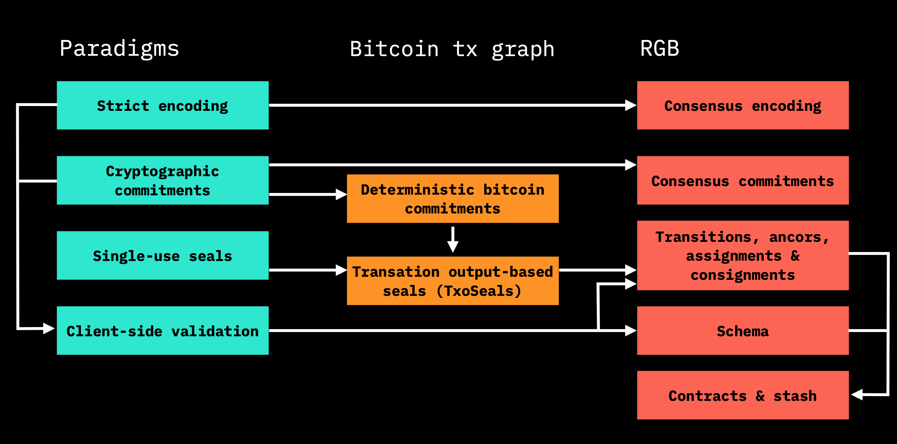

# 🎓 RGB paradigms

### RGB uses a paradigm-based approach:

* Layer isolation via abstraction
* Layer interaction via strictly-defined interfaces
* No future hardforks, just a single release

RGB is a set of standards. Inside the source code you will see a folder called [_Paradigms_](https://github.com/LNP-BP/rust-lnpbp/tree/refactor-structure/src/paradigms) implementing the paradigms RGB is using. Each part of RGB code follows some specific paradigm and can interact with other ones only through the interface, defined in the paradigm scope. This helps to audit the security model,  prevent the developers and users from making mistakes with the technology \(privacy leaks, security model breaches etc\) and if something still happens - isolate the problem.  
  
Paradigms are all completely independent from each other and are assembled into one system at the level of RGB itself.  
  
These paradigms are not even Bitcoin-specific. They are development/coding/architecture ones, that can be applied for many systems even outside the scope of Bitcoin and RGB.

### RGB paradigms:

* Strict encoding
* Single-use seals
* Cryptographic commitments
* Client-side validation

**Strict encoding** - the concept that we should use very formal and well defined practices of the data serialisation and deserialisation, encoding and decoding, so that they could work in the same _deterministic_ way on any computer hardware, both present and future one.  
With client-side validation it is important to be sure that the data saved today will be read and verified by all parties in a correct way, no matter how much time would pass. This is why strict serialisation rules, strict encoding rules and practices are very important - they ensure that the saved data will always be read and interpreted the same way by all parties.  
  
**Single-use seals** - the idea of development of cryptographic commitment protocols in the direction of enabling a person to commit to a commitment. It can be created on different types of medium \(even a centralised party\).   
  
**Cryptographic commitments** - though it's a quite known concept, RGB extended it into a new idea of _embed-commit-verify scheme._ With cryptographic commitments one is able to commit to some data \(RGB state, RGB assets, ownership structure etc.\) and embed those commitments into transactions. If you have some data \(message\) and you create a commitment to this data, the core feature of the commitment is that it is impossible get any valuable information about the original message that would help an attacker to guess or break it. But that's not all. With RGB _embed-commit-verify scheme_ you can't even know about the existence of the commitment in the first place. However, if you have an original message, or, in the case of _embed--commit scheme -_ a proof, you can use it and deterministically verify that a\) there is a commitment and b\) that the party which created the commitment also knew the initial message at some point in past.  
  
**Client-side validation** - meaning that all the data is kept outside of the bitcoin transactions, i.e. bitcoin blockchain or lightning channel state. This allows the system to operate on top of Lightning Network without any changes to the LN protocols and also gives a foundation for a high level of protocol scalability and privacy.  
  
Code covering RGB paradigms can be found [here](https://github.com/LNP-BP/rust-lnpbp/tree/refactor-structure/src/paradigms).

### RGB = these paradigms applied to Bitcoin transaction graph

Application is done through the following tools and primitives:

* **Strict encoding:** RGB consensus encoding \(LNPBP-10 standard; lnpbp::rgb::\* code reference\)
* **Single use seals:** transaction output-based seals \(LNPBP-11; lnpbp::bp::txo\_seals\)
* **Cryptographic commitments:**  - deterministic bitcoin commitments \(LNPBP-1, -2, -3; lnpbp::bp::dbc\) - multi-contract commitments \(LNPBP-4; lnpbp::lnpbps::lnpbp4\)
* **Client-side validation:**  - RGB Schema \(LNPBP-12; lnpbp::rgb::schema\) - RGB contracts \(LNPBP-13; lnpbp::rgb::{transition, stash, ancor, consignment}\)

### How RGB paradigms are interrelated

On a high level RGB can be visualised in form of 3 verticals: Paradigms, Bitcoin transaction graph and RGB itself. First two verticals can be applied and used even outside of Bitcoin; transaction graph \(in the middle\) is generic and can be used by many products and technologies \(existing today and future ones\) of Bitcoin Layer2/Layer 3; and only the last one is RGB-specific.   
In more details the relation can be described in the following way:

1. Strict encoding and cryptographic commitments are both used to build client-side validation.
2. With cryptographic commitments we create deterministic bitcoin commitments. It is the way of how we commit-embed into bitcoin transactions and parts of .
3. Using single-use seals applied to bitcoin timechain and deterministic commitments we build transaction output-base seals \(TxoSeals\).
4. Strict encoding and cryptographic commitments are used to create parts of RGB named consensus encoding and consensus commitments.
5. Transaction output based seals are used to create transitions, anchors, assignments & consignments and different other parts of RGB protocol.
6. Client-side validation is used to create the structures mentioned in p.5 and schema.
7. Schema and above mentioned structures allow us to reconstruct RGB contracts and stash.


While consensus encoding and consensus commitments are used by transitions & other structures of RGB, they are not used directly, but through the paradigm relation calling each other.



As an example, you can have one RGB contract that defines and works with only one asset. With time, this asset will create some history. You can also have multiple contracts, each of which will own multiple instances of some asset under it, and will be working together, creating their histories etc. All these contracts, histories and related data create what we call _Stash_. Basically, a stash is all the data related to the client-validation of RGB data that is owned and held by a specific party \(e.g. a wallet\).


